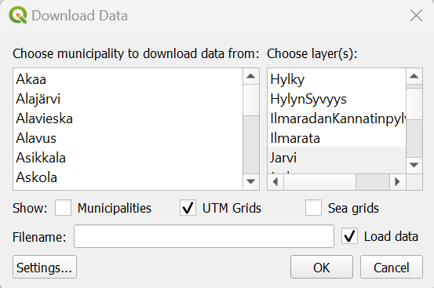

# NLS GeoPackage Downloader QGIS plugin

## Shortly in Finnish

Tällä QGIS 3 -lisäosalla voit hakea Maanmittauslaitoksen maastotietokannasta karttalehdittäin tai alueittain kohteita valmiiksi visualisoituna ja yhdisteltynä.

Tarvitset työkalun käyttöön käyttäjätunnuksen, jonka voit hakea täältä <http://www.maanmittauslaitos.fi/en/e-services/open-data-file-download-service/open-data-file-updating-service-interface>.

Aineisto haetaan MML:n ATOM-syötteen kautta, yhdistetään tietyt kohteet karttalehtien välillä ja visualisoidaan peruskarttalehteä muistuttavalla visualisoinnilla.

## Description

The tool can be found from QGIS official repository <https://plugins.qgis.org/plugins/NLSgpkgloader-master/>

Download data from the Finnish NLS Atom feed and create a GeoPackage with built-in styles.

This plugin lets users download layers from National Land Survey of Finland's (NLS-FI) topographical database using QGIS3. The data is visualised and dissolved when downloaded to QGIS. The lisence of the data is (CC-BY 4.0). The plugin fetches the NLS-FI Open data file updating service (Atom feed).

Before you can use the tool, you need to order a user-specific identification key from NLS to be able to use this plugin: <http://www.maanmittauslaitos.fi/en/e-services/open-data-file-download-service/open-data-file-updating-service-interface>.

Please report any issues you discover.

This plugin is available from the official plugin repository and can be installed from the QGIS Plugins menu.

**Developed by [Gispo Ltd.](https://www.gispo.fi)**

## Usage and installation

Please read [Instructions.md](nlsgpkgloader/documentation/instructions.md) for more information.

## Licences

This plugin utilizes data licensed by Traficom and National Land Survey of Finland. **Please read [nlsgpkgloader/resources/data/LICENCE.md](nlsgpkgloader/resources/data/LICENCE.md) for more information.**

The plugin source code is licensed under GPL v3.0, see [LICENCE](LICENCE).

The QGIS layer styles in [layer_styles.sql](nlsgpkgloader/resources/data/layer_styles.sql) are licensed under CC-BY-4.0, see [LICENCE.CC-BY-4](LICENCE.CC-BY-4).
