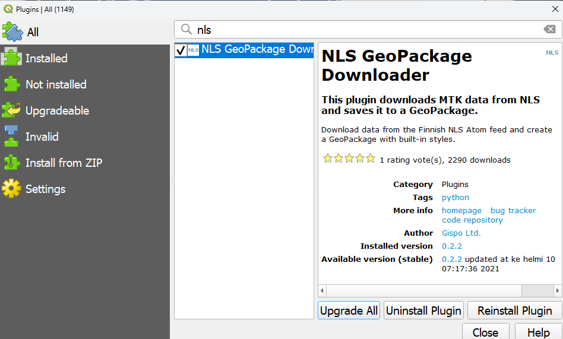
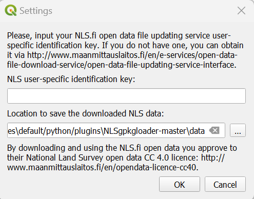
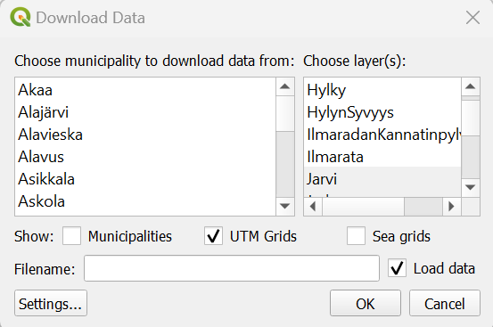
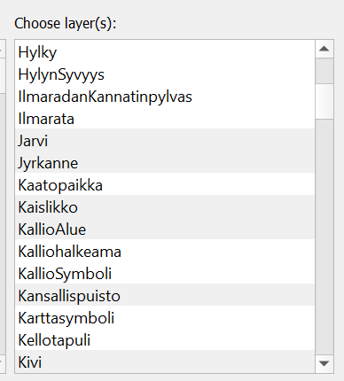
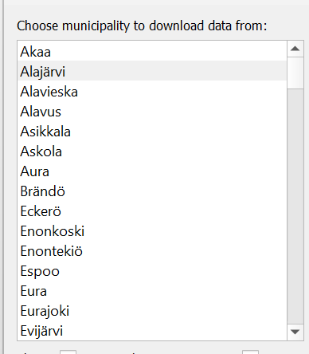
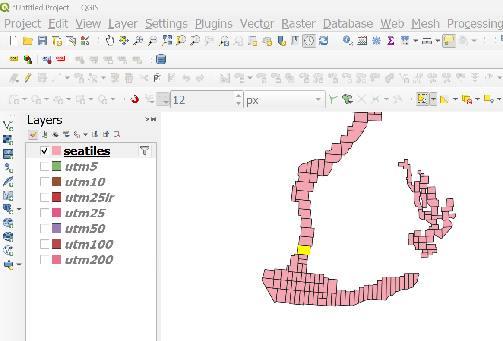
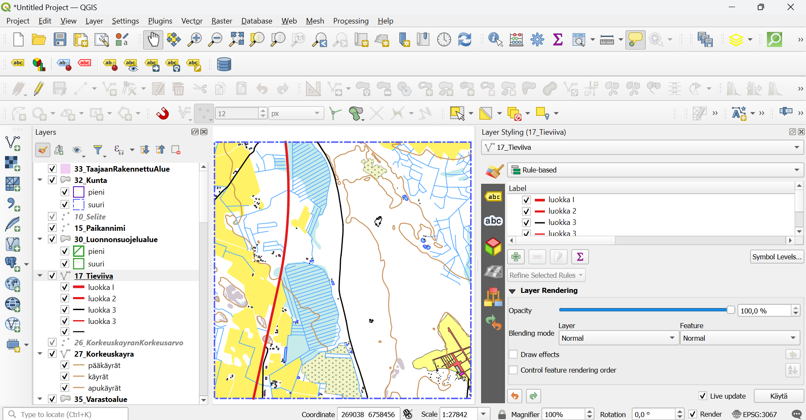

## Installation instructions

The plugin can be found from QGIS official repository: <https://plugins.qgis.org/plugins/NLSgpkgloader-master/>

Go to QGIS 3.X, Plugins and find "NLS GeoPackage Downloader" and install.

## Usage

Using the plugin is fairly straightforward:

1. Click the NLS plugin icon or go to Plugins/NLS GeoPackage Downloader.

2. First time you use the plugin a Settings window opens. Enter the valid identification key (received via email from NLS)
   and set the save directory. If this does not happen check step 3. You can also define in the Settings where the datasets are downloaded.

3. After this another pop-up window, Download Data, opens. If the Settings window did not open as described, you can
   find it by pushing Settings button in the left bottom corner of the Download Data window.

4. Now you can choose which layers and from what area you want to download the data. Note: the datasets are quite heavy, so it might take time if you choose a large area.

- Select the layers you want: Note that some layers are preselected because they have ready made visualisations. If you need data from only one layer deselect the layers you do not need.

- If you want the data from a certain municipality, choose the municipality form the list

- If you want to choose the data from a layer: choose Municipalities, UTM Grids or Sea Grids and the layers open to QGIS Layer-panel. There you can choose the wanted area by QGIS's select tools. You can also select multiple grids/municipalities at a same time.

5. Enter a filename. If you wish to load the GeoPackage layers into QGIS, activate Load data check box.

6. Click OK and wait for processing to finish. The tool fetches all the wanted layers and those that were preselected are always visualised and rule based visualisation created for certain classes. Also scale has been taken into accout so that e.g. road classes are shown differently in different scales. These can be edited via layer styling panel.

